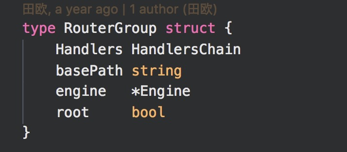

# Gin 分析
这里的Gin是指Golang语言里Web框架。[Gin](https://github.com/gin-gonic/gin)的使用简单方便，与node的express非常像。


## 如何开始?


起点是 调用`gin.Default()`函数生成默认引擎，也就是*Engine结构体。

签名如下：

简单概括里面功能：
- 根据当前环境选择打印warnning信息
- 生成 `*Engine`
- 默认使用 `log`、 `recovery` 中间件
- 返回 `*Engine`

然后使用`Engine`注册一个`/ping`路径 并绑定一个`HandlerFunc`.

最后 `Run(:addr)`启动整个引擎

## 那故事应该从`Engine`说起了！


以下几个比较重要：
- `RouterGroup` 管理路由组，实现`IRoutes`以及`IRouter`接口
- `HTMLRender` 模版引擎，默认使用golang下`template`作为模版引擎
- `trees`      存储`路径`以及对应`HandlerChain`详细信息
- `noRoute`、`noMethod` 默认404，405处理handler 可以通过`engine.NoRoute(...HandlerChain)``engine.Method(...HandlerChain)`设置

## 先说 `RouterGroup`
`RouterGroup`在`Engine` 里是内嵌结构体，它是这个样子的：


里面比较重要是`HandlerChain`:


`RouterGroup`实现了一下接口：


因为`RouterGroup`是内嵌在`Engine`里的所以 `Engine`具备了`Use`,`Get`等方法。

这些方法本质都是在生成`HandlerChain`和对应路径 保存在 trees里面
看下面例子：

### Example
```golang
    r := gin.New()
	r.Use(HandlerFn1, HandlerFn2)
	r.Get("/",HandlerFn3,HandlerFn4,HandlerIndex)
    admin := r.Group("/admin",HandlerAdminLimit1,HandlerAdminLimit2)
        .Get("/money",HandlerMoneyLimit,HandlerMoney)
        .Get("/vote",HanlderVoteLimit,HandlerVote)
        .Get("/email",HanlderEmailLimit,HandlerEmail)
```

#### `Use 使用`
```golang
func (group *RouterGroup) Use(middleware ...HandlerFunc) IRoutes {
	group.Handlers = append(group.Handlers, middleware...)
	return group.returnObj()
}
```
最初`engine.Handlers`是空的,添加了`HandlerFn1`,`HandlerFn2`后=>[HandlerFn1,HandlerFn2].`basePath`为‘/’


#### 当执行了`r.Get("/",HandlerFn3,HandlerFn4,HandlerIndex)`
```golang
// GET is a shortcut for router.Handle("GET", path, handle).
func (group *RouterGroup) GET(relativePath string, handlers ...HandlerFunc) IRoutes {
	return group.handle("GET", relativePath, handlers)
}

func (group *RouterGroup) handle(httpMethod, relativePath string, handlers HandlersChain) IRoutes {
	absolutePath := group.calculateAbsolutePath(relativePath)
	handlers = group.combineHandlers(handlers)
	group.engine.addRoute(httpMethod, absolutePath, handlers)
	return group.returnObj()
}

func (group *RouterGroup) combineHandlers(handlers HandlersChain) HandlersChain {
	finalSize := len(group.Handlers) + len(handlers)
	if finalSize >= int(abortIndex) {
		panic("too many handlers")
	}
	mergedHandlers := make(HandlersChain, finalSize)
	copy(mergedHandlers, group.Handlers)
	copy(mergedHandlers[len(group.Handlers):], handlers)
	return mergedHandlers
}

```
拼接`RouterGroup`路径和HandlerChain,存在`trees` 里面


```javascript
{
    path:"/",
    handlers:[HandlerFn1,HandlerFn2,HandlerFn3,HandlerFn4,HandlerIndex]
}
```
将这样的信息（还有其他附加信息）添加到`engine.trees`里。

#### 当执行`   admin := r.Group("/admin",HandlerAdminLimit1,HandlerAdminLimit2)`

`admin` 这个新的`RouterGroup`的信息是这样

```javascript
{
    basePath:"/admin",
    Handlers:[HandlerFn1,HandlerFn2,HandlerAdminLimit1,HandlerAdminLimit2]
}
```

#### 执行了`.Get("/money",HandlerMoneyLimit,HandlerMoney)`


将`admin`里面的`basePath`拼接当前路径
将`admin`里面的`Handlers`以及当前传入的`HandlerChain`copy到新的`HandlerChain`下


```javascript
{
    path:"/admin/money",
    handlers:[HandlerFn1,HandlerFn2,HandlerAdminLimit1,HandlerAdminLimit2,HandlerMoneyLimit,HandlerMoney]
}
```
将这样的信息（还有其他附加信息）添加到`engine.trees`里,下面以此类推。

### 这些信息如何使用呢？

 当客户端请求“/admin/money”,`Engine`在`tree`里搜索返回`[HandlerFn1,HandlerFn2,HandlerAdminLimit1,HandlerAdminLimit2,HandlerMoneyLimit,HandlerMoney]`所有这些`handler`,使用一个`*Context`上下文
 ```golang
 // ServeHTTP conforms to the http.Handler interface.
func (engine *Engine) ServeHTTP(w http.ResponseWriter, req *http.Request) {
	c := engine.pool.Get().(*Context)
	c.writermem.reset(w)
	c.Request = req
	c.reset()

	engine.handleHTTPRequest(c)

	engine.pool.Put(c)
}

func (c *Context) Next() {
	c.index++
	s := int8(len(c.handlers))
	for ; c.index < s; c.index++ {
		c.handlers[c.index](c)
	}
}
 ```

 `Context`可以中断`HandlerChain`的执行。比如，用户权限未认证。

 做到极致，我们可以这样：[gin 代码](../src/gin/demo01/main.go)

 ```Go
 package main

import (
	"fmt"

	"github.com/gin-gonic/gin"
)

type MuxteMap struct{}

func (m *MuxteMap) Get(key string)                    {}
func (m *MuxteMap) Set(key string, value interface{}) {}

type UnitFunc func(m *MuxteMap)
type UnitFuncs []UnitFuncs

func AuthLimit() gin.HandlerFunc {
	return func(c *gin.Context) {
		//  这里处理业务需求
		fmt.Println("this is in AuthLimit")
	}
}

func News() gin.HandlerFunc {
	return func(c *gin.Context) {
		//  这里处理业务需求
		fmt.Println("this is in News")
		c.Set(
			"unitFn",
			setUnitFn(c, func(m *MuxteMap) {
				// 获取数据
				m.Set("some key", "some Value")
			}),
		)
	}
}

func Spot() gin.HandlerFunc {
	return func(c *gin.Context) {
		//  这里处理业务需求
		fmt.Println("this is in Spot")
		c.Set(
			"unitFn",
			setUnitFn(c, func(m *MuxteMap) {
				// 获取数据
				m.Set("some key", "some Value")
			}),
		)
	}
}

func Future() gin.HandlerFunc {
	return func(c *gin.Context) {
		//  这里处理业务需求
		fmt.Println("this is in Future")
		c.Set(
			"unitFn",
			setUnitFn(c, func(m *MuxteMap) {
				// 获取数据
				m.Set("some key", "some Value")
			}),
		)
	}
}

func Vote() gin.HandlerFunc {
	return func(c *gin.Context) {
		//  这里处理业务需求
		fmt.Println("this is in Future")
		c.Set(
			"unitFn",
			setUnitFn(c, func(m *MuxteMap) {
				// 获取数据
				m.Set("some key", "some Value")
			}),
		)
	}
}

func HTML() gin.HandlerFunc {
	return func(c *gin.Context) {
		//  这里处理业务需求
		fmt.Println("this is in HTML")
	}
}

func JSON() gin.HandlerFunc {
	return func(c *gin.Context) {
		//  这里处理业务需求
		fmt.Println("this is in JSON")
	}
}

func main() {
	engine := gin.Default()

	admin := engine.Group("/admin", AuthLimit())
	{
		admin.GET("/index", News(), Spot(), Future(), HTML())
		admin.GET("/vote", News(), Spot(), Vote(), HTML())
	}

	api := engine.Group("/api", AuthLimit())
	{
		api.GET("/vote", Vote(), JSON())
	}
	engine.Run(":8080")
}

func setUnitFn(c *gin.Context, unit UnitFunc) UnitFuncs {
	return UnitFuncs{}
}
 ```

 ## 再说下 `tree`

 ```golang
type methodTree struct {
	method string
	root   *node
}

type methodTrees []methodTree

type node struct {
	path      string
	wildChild bool
	nType     nodeType
	maxParams uint8
	indices   string
	children  []*node
	handlers  HandlersChain
	priority  uint32
}
 ```
  


